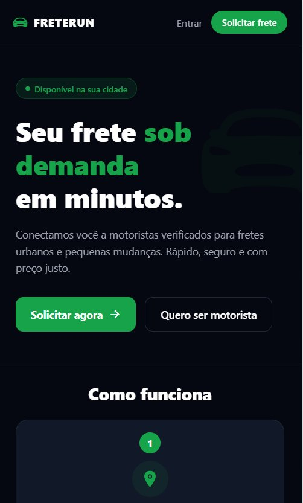
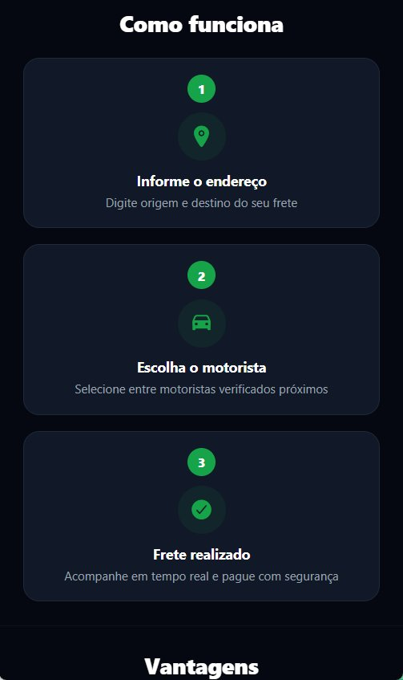
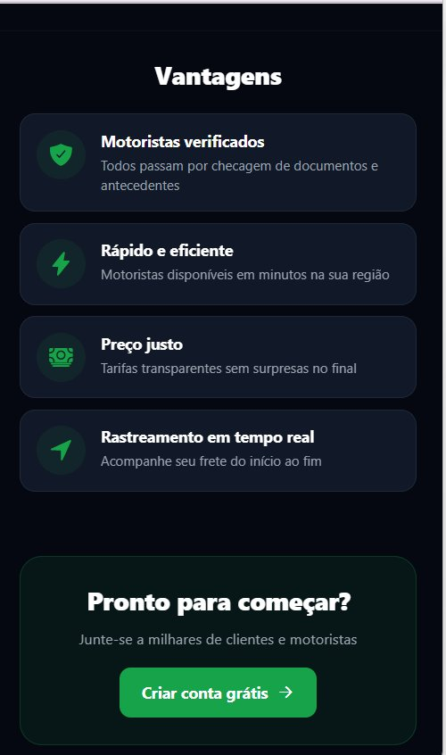
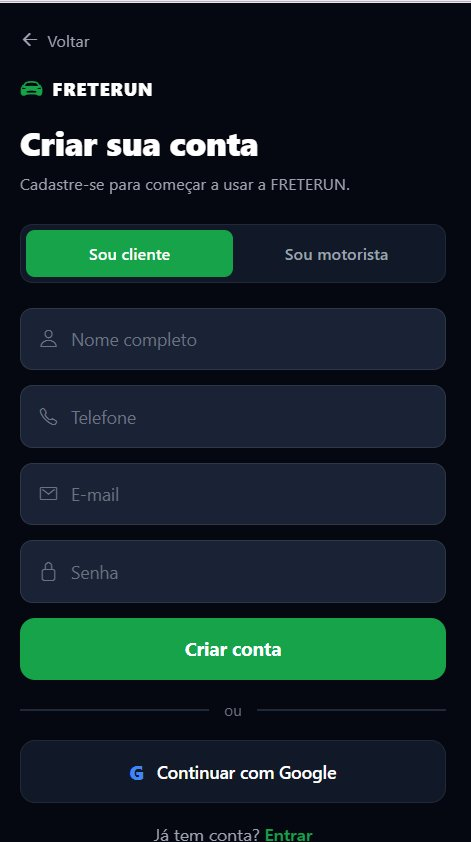
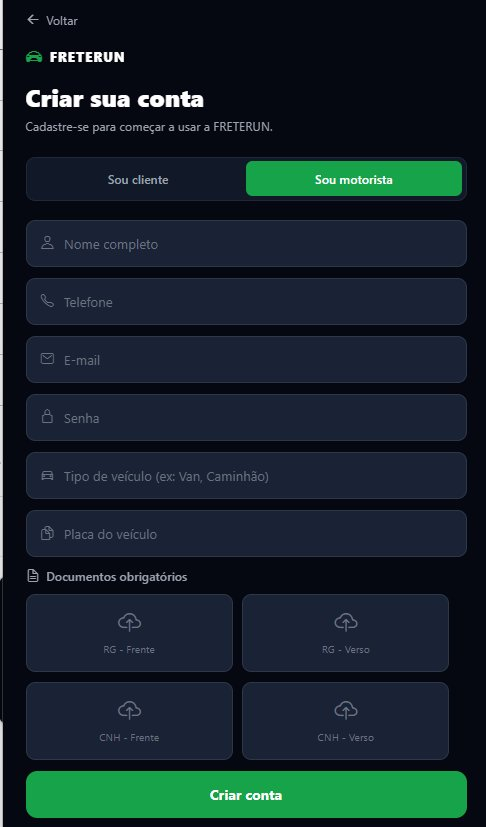
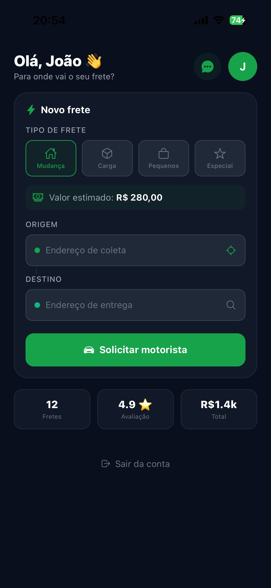
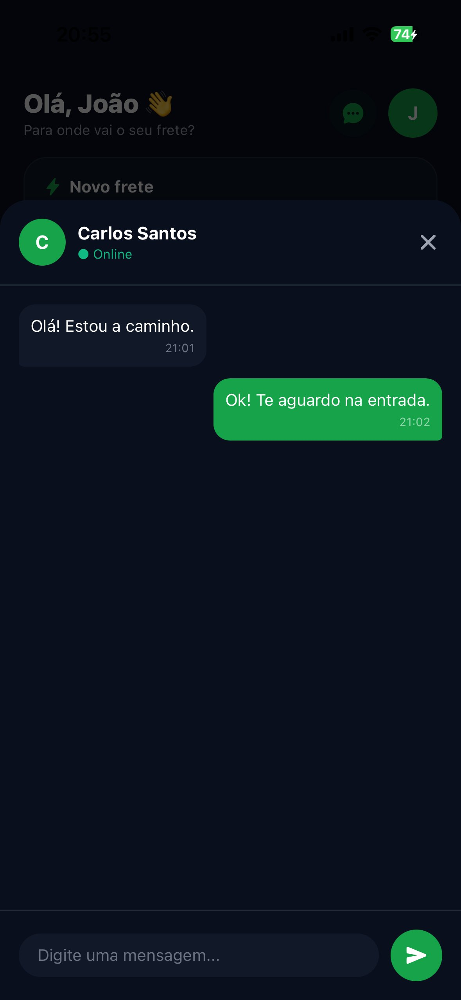

# 🚛 FreteRun - Mobile App

Aplicativo mobile desenvolvido em **React Native com Expo**, que conecta **clientes e motoristas** para realização de fretes e mudanças de forma digital, segura e eficiente.

---

## 👥 Integrantes da Equipe

| Nome |
|---|
| Victor Daniel |
| Gabriel Freitas |
| João Davi |
| Luiz Gustavo |

---

## 📋 Descrição

O **FreteRun** é um aplicativo mobile no estilo Uber, voltado para o segmento de fretes e mudanças urbanas. Conecta clientes que precisam transportar cargas a motoristas verificados disponíveis na região, oferecendo rastreamento em tempo real, chat integrado e sistema de avaliação.

---

## 📸 Telas do aplicativo

### 🏠 Landing Page


### ℹ️ Como Funciona


### ✅ Vantagens


### 📝 Cadastro — Cliente


### 📝 Cadastro — Motorista


### 📦 Dashboard do Cliente


### 💬 Chat com Motorista


---

## 🚀 Como executar

### Dependências necessárias
- Node.js (versão LTS) — https://nodejs.org
- Expo Go instalado no smartphone

### Passos

```bash
# 1. Clonar o repositório
git clone https://github.com/Viictor-Siilva/PROJETO-FRETERUN.git
cd PROJETO-FRETERUN

# 2. Instalar dependências
npm install --legacy-peer-deps

# 3. Iniciar o projeto
npx expo start --tunnel --clear
```

Escaneie o QR Code com o **Expo Go** no smartphone.

---

## ✨ Funcionalidades Implementadas

### 🔐 Autenticação e Persistência
- **AsyncStorage**: Persistência de dados local para usuários e fretes
- **Validações Robustas**: Verificação de e-mail, telefone, senha forte e campos obrigatórios
- **Sistema de Login**: Suporte a múltiplos perfis com usuários de teste pré-carregados

### 🏠 Landing Page
- Design moderno e responsivo inspirado no Lovable
- Navegação fluida para fluxos de cliente e motorista

### 📦 Gestão de Fretes
- **Dashboard Cliente**: Solicitação de fretes com estimativa de preço em tempo real
- **Rastreamento**: Fluxo de acompanhamento com 6 etapas animadas
- **Dashboard Motorista**: Lista de fretes disponíveis e resumo de ganhos diários

### 💬 Comunicação e Feedback
- **Chat Modal**: Interface de chat integrada entre cliente e motorista
- **Sistema de Avaliação**: Modal de feedback com sistema de estrelas
- **Toasts Customizados**: Feedback visual para ações do usuário

---

## 👥 Usuários de teste

| Nome | E-mail | Perfil | Senha |
|---|---|---|---|
| João Silva | joao@email.com | Cliente | 123456 |
| Maria Oliveira | maria@email.com | Cliente | 123456 |
| Ana Costa | ana@email.com | Cliente | 123456 |
| Carlos Santos | carlos@email.com | Motorista | 123456 |
| Pedro Alves | pedro@email.com | Motorista | 123456 |

---

## 🗂️ Estrutura do projeto

```
FreteRun/
├── App.js                 ← Componente principal e navegação
├── index.js               ← Entry point
├── app.json               ← Configuração do Expo
├── package.json           ← Dependências
├── src/
│   ├── components/        ← Componentes reutilizáveis (Chat, Avaliação, Toast)
│   ├── services/          ← Lógica de dados (Auth, Fretes com AsyncStorage)
│   └── utils/             ← Constantes, Validações e Estilos globais
├── screenshots/           ← Prints das telas
└── assets/                ← Imagens e recursos estáticos
```

---

## 👨‍💻 Tecnologias

- **React Native** (v0.81)
- **Expo SDK 54**
- **AsyncStorage** — Persistência local de dados
- **@expo/vector-icons** — Ícones (Ionicons)
- **JavaScript**

---

## 🎨 Design

- **Tema**: Dark Mode
- **Cor Primária**: Verde `#16A34A`
- **Background**: `#0A0F1E`
- **Inspiração**: Lovable.dev

---

## 📝 Changelog

### v1.1.0
- Adicionado indicador de versão no rodapé
- Atualização da documentação com integrantes da equipe
- Otimização geral do código

### v1.0.0
- Versão inicial com todas as telas implementadas
